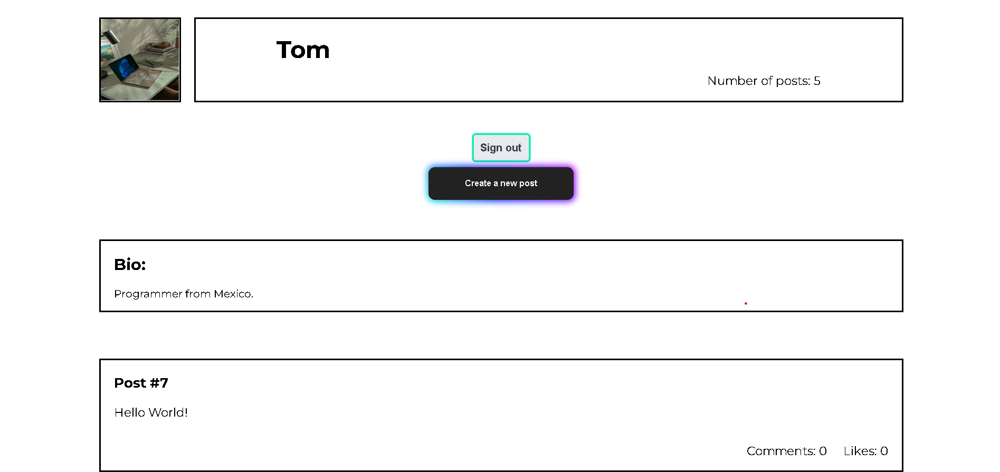

# Blog-App

The Blog app will be a classic example of a blog website. I will create a fully functional website that will show the list of posts and empower readers to interact with them by adding comments and liking posts.

## Screenshot

## Built With

- Ruby on Rails
- PostgreSQL
- Gems (Gemfile)
- Linters (Rubocop)
- VSCode
- Git Bash
- GitHub

## Getting Started

To get a local copy up and running follow these simple example steps.

### Prerequisites

- Laptop or Desktop
- Web Browser
- Ruby (installed and set up)
- IDE (preferably Visual Studio Code)
- Programming Knowledge

### Setup

- Clone GitHub repository `gh repo clone SaidRasinlic/Blog-App-II`
- (git) cd Blog-App
- Open terminal and run the command *_$irb_* (Interactive Ruby Shell)
- Run the program functions, you are ready to start!

## Authors

👤 **Said Rasinlic**

- GitHub: [@GitHub/SaidRasinlic](https://github.com/SaidRasinlic)
- Twitter: [@Twitter/SaidRasinlic](https://twitter.com/SaidRasinlic)
- LinkedIn: [@LinkedIn/SaidRasinlic](https://www.linkedin.com/in/SaidRasinlic)

## 🤝 Contributing

Contributions, issues, and feature requests are welcome!

Feel free to check the [issues page](../../issues/).

## Show your support

Give a ⭐️ if you like this project!

## Acknowledgments

- Microverse 

## 📝 License

This project is [MIT](LICENSE) licensed.
